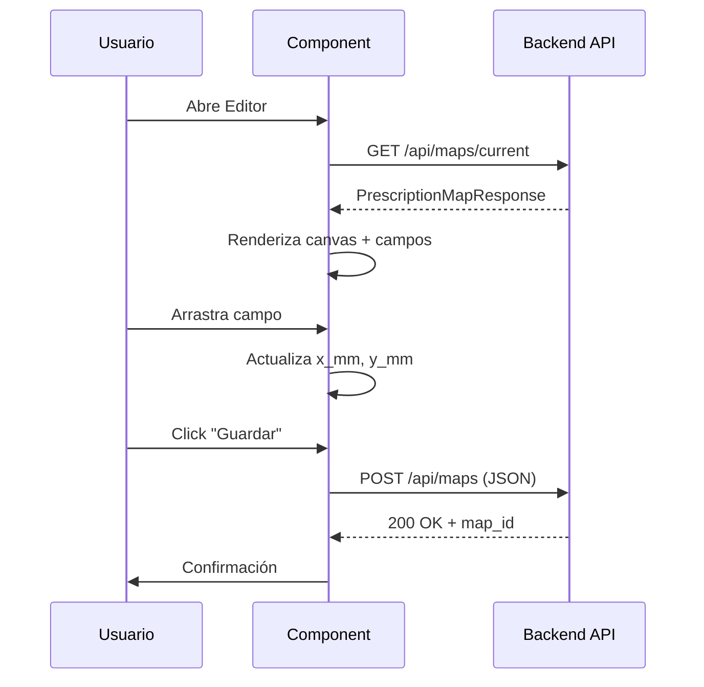

# Especificación de Contrato: Editor Visual de Mapas de Impresión (Slice 06.2)

## 1. Contexto y Descubrimiento

### Componente Existente Identificado
**`frontend/src/components/TalonarioCalibrator.tsx`** - Este componente ya implementa la funcionalidad completa del editor visual de mapas de coordenadas.

### Funcionalidades Implementadas
✅ **Carga de imagen de fondo** (líneas 72-82)
✅ **Canvas con aspect ratio A5** (líneas 255-266)
✅ **Drag & Drop de campos** (líneas 92-126)
✅ **Ajuste fino con teclado** (líneas 129-152, paso de 0.5mm)
✅ **Conversión px ↔ mm** (líneas 85-89, 99-101)
✅ **Persistencia vía API** (líneas 157-189)
✅ **Carga de configuración guardada** (líneas 38-69)
✅ **Prueba de impresión** (líneas 191-200)

## 2. Análisis de Integración con Backend

### API Endpoints Utilizados
```typescript
// GET - Carga configuración existente
GET http://127.0.0.1:8000/api/maps
Response: PrescriptionMapResponse

// POST - Guarda nueva configuración
POST http://127.0.0.1:8000/api/maps
Body: FormData {
  data: JSON.stringify(PrescriptionMapCreate),
  image?: File
}
```

### Contrato de Datos
El componente ya usa el contrato definido en Slice 06.1:
```typescript
interface FieldConfig {
    field_key: string;
    label: string;
    x_mm: number;
    y_mm: number;
    font_size_pt: number;
    max_width_mm: number;
}

// Payload enviado al backend
{
    name: string;
    canvas_width_mm: 148.0;  // A5
    canvas_height_mm: 210.0; // A5
    fields_config: FieldConfig[];
}
```

## 3. Gap Analysis

### ✅ Funcionalidades Completas
- Canvas visual con proporción correcta
- Sistema de drag & drop robusto
- Conversión precisa de coordenadas
- Integración con API backend
- Persistencia de estado

### ⚠️ Mejoras Necesarias (Fase B)

#### 3.1 Autenticación
**Problema:** Hardcoded URL sin token JWT
```typescript
// Línea 41, 172
fetch('http://127.0.0.1:8000/api/maps')
```

**Solución:** Usar contexto de autenticación
```typescript
const token = localStorage.getItem('token');
headers: { 'Authorization': `Bearer ${token}` }
```

#### 3.2 Multipart/Form-Data vs JSON
**Problema:** Backend espera JSON puro (Slice 06.1), pero componente envía FormData
```typescript
// Línea 166-168
formData.append('data', JSON.stringify(mapData));
formData.append('image', imageFile);
```

**Decisión:** Mantener JSON puro por ahora (imagen opcional para v2)

#### 3.3 Feature Flag
**Problema:** No verifica `prescription_coords_v1`
**Solución:** Añadir check en `useEffect` inicial

#### 3.4 Campos por Defecto
**Problema:** Hardcoded `DEFAULT_FIELDS` (líneas 18-25)
**Solución:** Definir en contrato compartido o cargar desde backend

## 4. Propuesta de Refactorización (Fase A)

### Opción 1: Renombrar y Adaptar
Renombrar `TalonarioCalibrator.tsx` → `PrescriptionMapEditor.tsx`
- Añadir autenticación
- Simplificar a JSON puro
- Añadir feature flag check

### Opción 2: Crear Wrapper
Mantener `TalonarioCalibrator.tsx` como está
- Crear `PrescriptionMapEditorPage.tsx` que lo envuelva
- Inyectar dependencias (auth, API base URL)

**Recomendación:** **Opción 1** - Refactorizar directamente para evitar duplicación

## 5. Estructura de Props y Estado (TypeScript)

### Props Interface
```typescript
interface PrescriptionMapEditorProps {
    onClose?: () => void;
    initialMapId?: number;
}
```

### Estado Interno
```typescript
const [backgroundImage, setBackgroundImage] = useState<string | null>(null);
const [fields, setFields] = useState<FieldConfig[]>(DEFAULT_FIELDS);
const [selectedField, setSelectedField] = useState<string | null>(null);
const [isDragging, setIsDragging] = useState(false);
const [mapName, setMapName] = useState("Mi Talonario");
const [mapId, setMapId] = useState<number | null>(null);
const [loading, setLoading] = useState(true);
const [saving, setSaving] = useState(false);
```

### Hooks Utilizados
- `useRef<HTMLDivElement>` - Referencia al canvas
- `useCallback` - Optimización de event handlers
- `useEffect` - Carga inicial, event listeners

## 6. Flujo de Datos



## 7. Criterios de Aceptación (Fase B - Tests)

### Test de Integración
```typescript
describe('PrescriptionMapEditor', () => {
  it('should load existing map configuration', async () => {
    // Mock GET /api/maps/current
    // Verify fields are positioned correctly
  });

  it('should update field position on drag', () => {
    // Simulate mousedown + mousemove
    // Verify x_mm, y_mm updated
  });

  it('should save configuration to backend', async () => {
    // Mock POST /api/maps
    // Verify payload matches PrescriptionMapCreate schema
  });
});
```

### Smoke E2E
1. Usuario autenticado abre editor
2. Carga imagen de fondo
3. Mueve campo "Nombre Paciente"
4. Guarda configuración
5. Verifica que GET /api/maps/current retorna nueva posición

## 8. FILES-TO-TOUCH (Fase C)

```
frontend/src/components/TalonarioCalibrator.tsx  (Refactor → PrescriptionMapEditor.tsx)
frontend/src/pages/Settings.tsx                   (Añadir link al editor)
frontend/src/contracts/prescription_map.ts        (Ya existe, sin cambios)
```

## 9. Feature Flag

```json
// config/feature-flags.json
{
  "prescription_coords_v1": true  // Ya habilitado en Slice 06.1
}
```

## 10. Próximos Pasos

**Fase A (Actual):** ✅ Especificación completa
**Fase B:** Crear tests para el componente refactorizado
**Fase C:** Refactorizar `TalonarioCalibrator` → `PrescriptionMapEditor`
**Fase D:** Verificación E2E

---

## Conclusión

El componente `TalonarioCalibrator.tsx` es una implementación **espectacular** y completa del editor visual. Solo requiere ajustes menores de autenticación y simplificación del payload para alinearse con el contrato de Slice 06.1.
